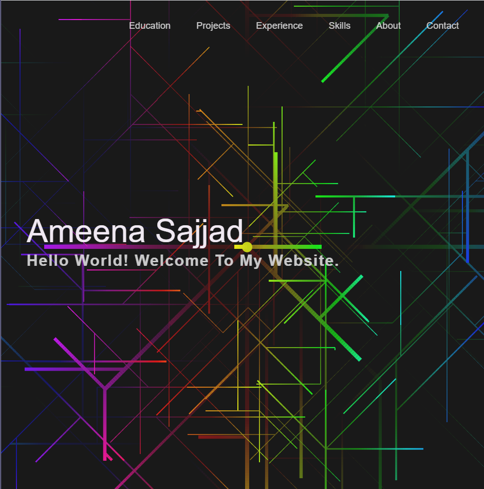
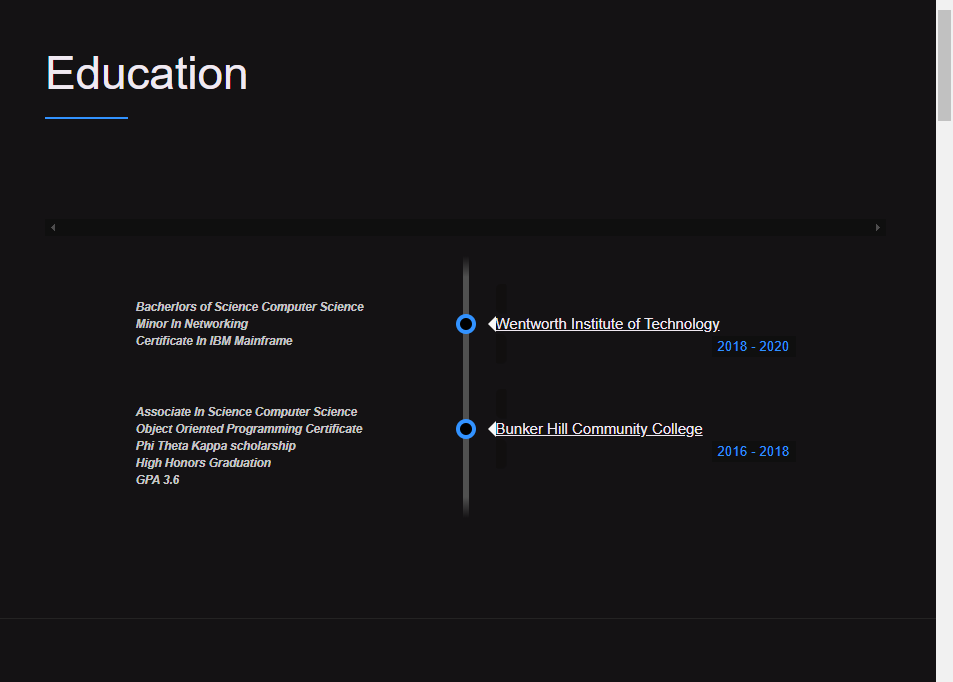
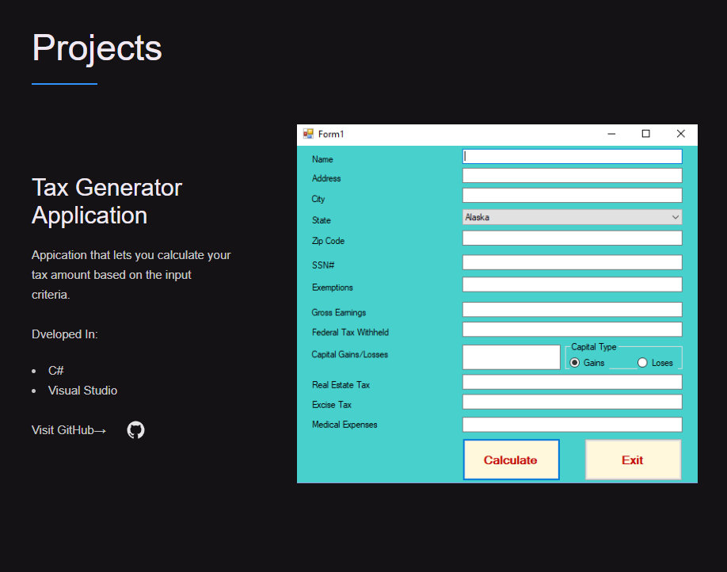
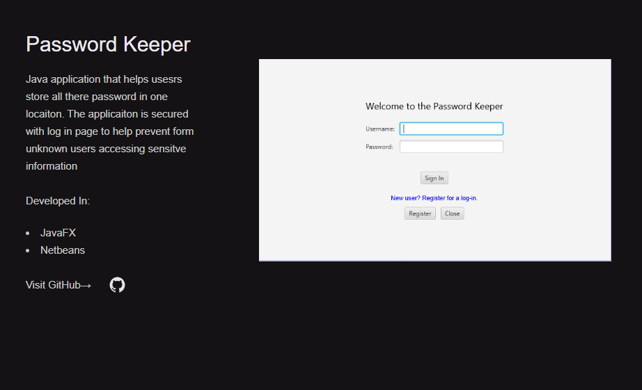
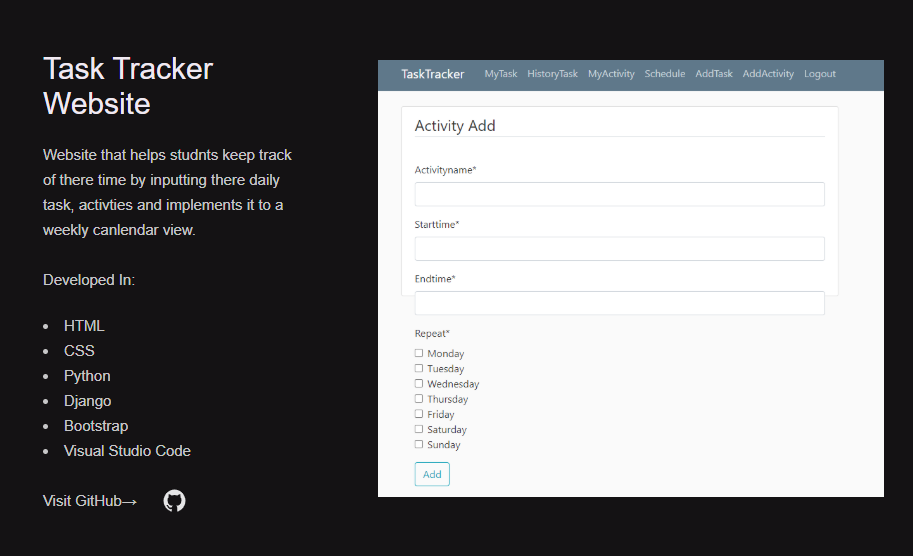
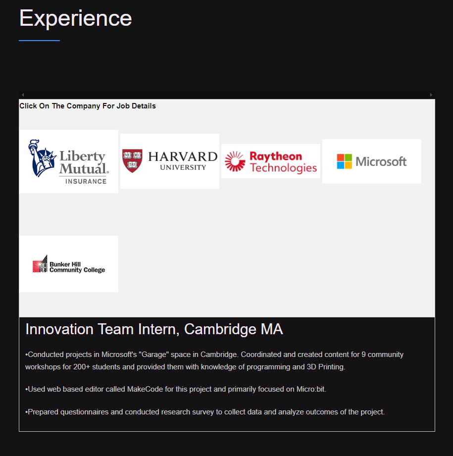
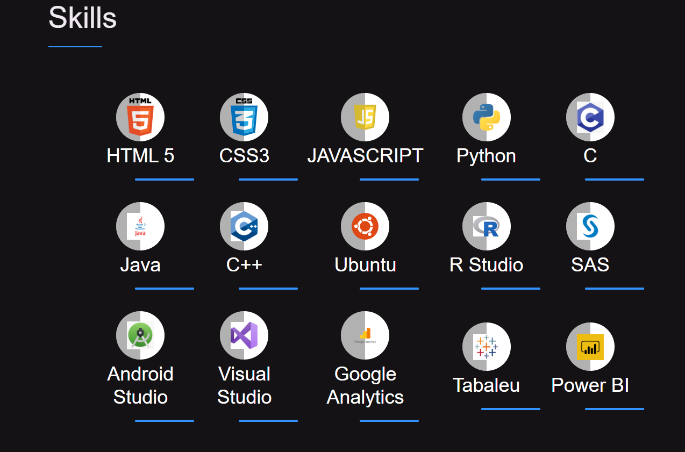
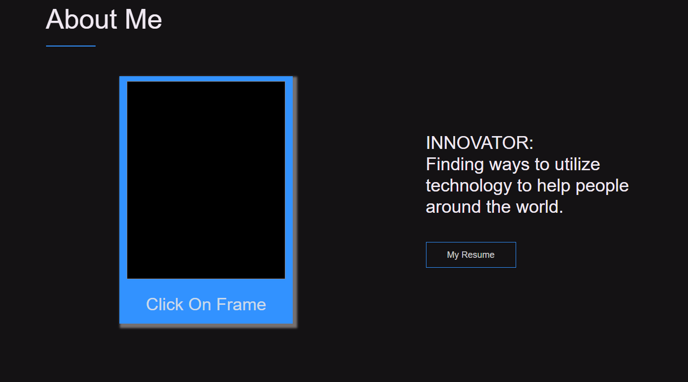
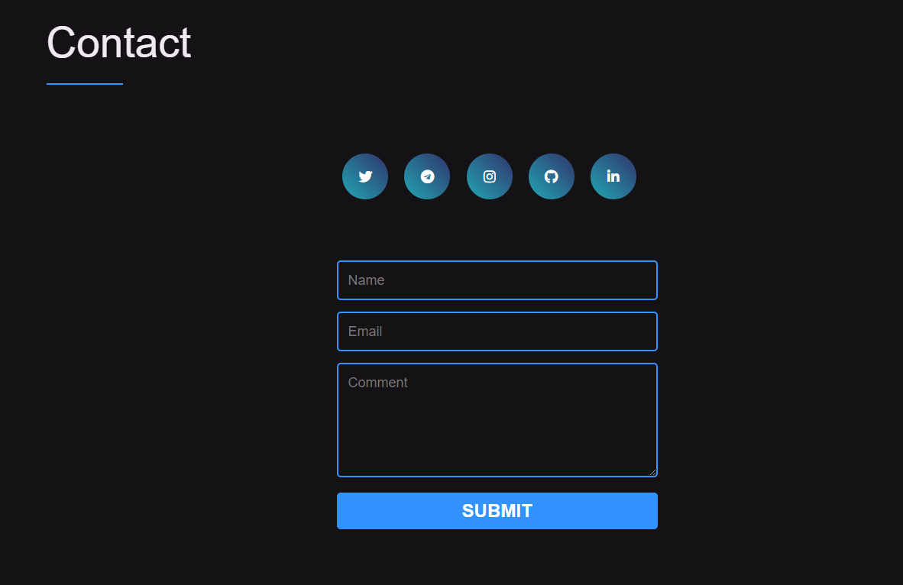

# Portfolio Website

Created a website in my free time to learn using CSS, HTML, Javascript in Visual Studio Code.
This website includes my - Education, Prorject, Experience, Skills and Contact.

This website is not my final product I am still making changes to integrating SASS code and making my webstie more interactive.

View my website by clicking the beow link (Warning: Not compatible with Microsoft Edge & Internet Explorer):
https://ameenasajjad26.github.io/Portfolio/.

**Captures of my website.**

